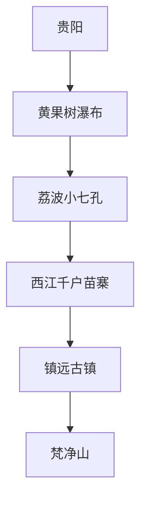
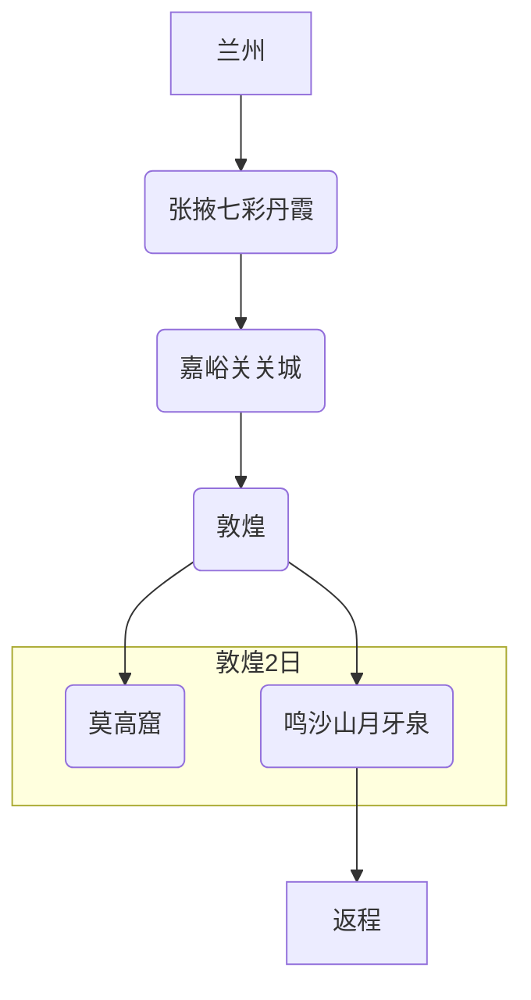

***

# 🇨🇳 2025中国深度旅行指南（10省精华版）

随着新一年的到来，中国的壮丽山河与千年文脉正等待着探索者的脚步。这份2025年最新版深度旅行指南，精选了中国最具代表性的10个省份，涵盖行程规划、交通住宿、费用参考及实用避坑建议，旨在为您提供一场省心、深度且难忘的旅行体验。

---
### 🌄 一、四川旅行指南（5天4夜经典路线）
**最佳时间**：3-6月（春季花海）、9-11月（秋色绝景）
**行程推荐**：
1.  **Day1**：成都抵达 → 宽窄巷子（免费） → 锦里夜市（体验火锅/串串）
2.  **Day2**：成都 → 乐山大佛（门票80元） → 峨眉山（金顶索道120元，宿雷洞坪）
3.  **Day3**：峨眉山日出 → 返成都 → 青城山（前山门票80元，道教文化）
4.  **Day4**：都江堰（门票80元，水利工程） → 熊猫基地（55元，早7点看喂食）
5.  **Day5**：三星堆（72元，青铜面具） → 返程

**交通**：
*   成都市区地铁+打车；景区间包车（7座商务车约800元/天）或高铁（成都→乐山0.5h）
**住宿**：
*   成都春熙路商圈（200-500元/晚）、峨眉山雷洞坪民宿（300-600元/晚）
**费用参考**：人均1500-2000元（含门票、住宿、交通）
**避坑提示**：
*   九寨沟等高原区备红景天、氧气瓶（当地价15-30元）
*   警惕低价团，选择正规导游（如携程认证导游阿慧）

---
### 🏔️ 二、新疆旅行指南（北疆+南疆10日精华）
**区域特色**：
*   **北疆**（6-9月）：喀纳斯湖（秋景绝美）、赛里木湖（6月野花）、独库公路（一日四季）
*   **南疆**（9-10月）：喀什古城（开城仪式）、塔克拉玛干沙漠（胡杨林）、帕米尔高原（需边防证）

**行程规划**：

**交通**：
*   包车7座商务（1000元/天，独库公路限7座以下）
*   火车专列（如“新东方快车”适合家庭游）
**住宿**：
*   禾木小木屋（800-1500元/晚）、喀什古城民宿（300-600元/晚）
**美食**：手抓饭（布尔津夜市）、烤包子（3元/个）、大盘鸡（伊宁）
**避坑**：
*   南疆用高德导航（百度更新慢）；沙漠公路备防风沙面罩。

---
### 🏯 三、山东旅行指南（文化自然5日游）
**必去景点**：
*   **济南**：趵突泉（40元）、大明湖（免费）
*   **泰安**：泰山（115元，夜爬观日出）
*   **曲阜**：三孔联票（140元，孔庙+孔府+孔林）

**行程推荐**：
1.  **Day1**：济南（趵突泉→大明湖→芙蓉街小吃）
2.  **Day2**：泰安（红门徒步登泰山，宿山顶）
3.  **Day3**：泰山日出 → 缆车下山 → 曲阜
4.  **Day4**：三孔景区（早8点避开人流） → 青岛
5.  **Day5**：栈桥→崂山（道教圣地）

**交通**：城际高铁（济南→泰安17min，泰安→曲阜40min）
**美食**：济南把子肉、泰山煎饼卷葱、曲阜孔府宴
**贴士**：
*   泰山索道单程100元；曲阜三孔请讲解员（60元/小时）深度游。

---
### 🌺 四、云南旅行指南（7日昆大丽香线）
**最佳季节**：10月-次年4月（避雨季，雪山可见度高）
**行程亮点**：
*   **昆明**：滇池（红嘴鸥）、石林（130元）
*   **大理**：洱海骑行（西岸廊道租电动车80元/天）、双廊下午茶（68元套餐）
*   **丽江**：玉龙雪山（140元+索道）、白沙古镇（免费纳西古乐）
*   **香格里拉**：普达措（138元）、松赞林寺（90元）

**交通**：
*   昆明→大理高铁2h（二等座145元）、大理→丽江火车1.5h
**住宿**：
*   大理双廊海景房（500-1200元）、香格里拉藏式客栈（带地暖，300-600元）
**防坑**：
*   玉龙雪山索道提前3天预约；野生菌火锅选择正规店（人均80元）。

---
### 🌿 五、贵州旅行指南（5日山水人文环线）
**核心景点**：
*   **黄果树瀑布**（旺季160元，4-6月水量最大）
*   **荔波小七孔**（120元，水上森林）
*   **西江千户苗寨**（65元，晨雾+长桌宴）

**行程规划**：

**交通**：
*   贵阳机场→市区地铁30min；景区直通车（贵阳→黄果树60元/人）
**美食**：酸汤鱼（凯里）、丝娃娃（贵阳街头）、羊肉粉（遵义）
**住宿**：
*   苗寨吊脚楼（200-500元，隔音差但体验佳）、镇远河景客栈（300-700元）
**预算**：人均1200-1800元（含门票、住宿、交通）

---
### 🏺 六、陕西旅行指南（4日古都寻踪）
**最佳时间**：3-5月、9-11月（春秋两季，气候宜人）
**行程推荐**：
1.  **Day1**：西安抵达 → 回民街/洒金桥（美食探索）→ 钟鼓楼夜景
2.  **Day2**：东线一日游 → 兵马俑（门票120元） → 华清宫
3.  **Day3**：西安城墙（租自行车环游，45元/2h） → 大雁塔（音乐喷泉）
4.  **Day4**：陕西历史博物馆（免费但需提前7天预约） → 大唐不夜城 → 返程

**交通**：
*   市区地铁覆盖主要景点；火车站东广场乘“游5/306路”公交直达兵马俑
**住宿**：
*   钟楼/南门附近（交通便利，300-600元/晚）
**费用参考**：人均1000-1500元
**避坑提示**：
*   陕历博门票极难抢，务必在官方公众号/小程序蹲点预约。
*   “游5”有真假之分，选择国营、上车买票的蓝色大巴，拒绝拉客人员。

---
### 🏞️ 七、湖南旅行指南（5日奇山秀水）
**最佳时间**：4-6月、9-10月（避开雨季和寒冬）
**行程亮点**：
*   **张家界国家森林公园**（阿凡达悬浮山原型，门票227元，4日有效）
*   **天门山**（玻璃栈道、天门洞，门票278元）
*   **凤凰古城**（沱江泛舟、吊脚楼夜景）

**行程规划**：
1.  **Day1**：抵达张家界 → 入住武陵源
2.  **Day2**：森林公园 → 袁家界（百龙天梯） → 杨家界
3.  **Day3**：天门山 → 晚乘车赴凤凰古城
4.  **Day4**：凤凰古城闲逛 → 沱江泛舟 → 晚上赏夜景
5.  **Day5**：从凤凰返程（可至铜仁/怀化乘高铁）

**交通**：张家界景区内环保车免费；张家界到凤凰有大巴（4h）
**住宿**：武陵源门票站附近（方便入园）、凤凰古城江景客栈（300-800元）
**美食**：三下锅、血粑鸭、米粉
**贴士**：
*   张家界景区很大，路线复杂，建议提前规划或请当地向导。
*   玻璃栈道现场租鞋套（5元），恐高者慎选。

---
### 🏜️ 八、甘肃旅行指南（6日丝路瑰宝）
**最佳时间**：5-10月（瓜果香甜，景色壮美）
**行程规划**：

**交通**：
*   高铁串联兰州、张掖、嘉峪关；敦煌需乘火车或飞机抵达。当地建议包车（400-600元/天）。
**住宿**：
*   敦煌市区（选择多，方便觅食）、鸣沙山附近（可看沙漠日出）
**费用参考**：人均2500-4000元（交通成本高）
**避坑提示**：
*   莫高窟门票必须提前30天在官网实名预约！分为A/B/C类票，A类可看8个窟。
*   沙漠日照强烈，物理防晒（帽子、墨镜、面巾）比防晒霜更有效。

---
### 🛶 九、广西旅行指南（5日桂林山水）
**最佳时间**：4-10月（漓江水量充沛）
**行程推荐**：
1.  **Day1**：桂林抵达 → 象鼻山 → 两江四湖夜游
2.  **Day2**：龙脊梯田一日游（金坑大寨观景点，看日落）
3.  **Day3**：漓江精华段（兴坪-九马画山，竹筏漂流）→ 抵达阳朔 → 西街
4.  **Day4**：阳朔 → 遇龙河竹筏漂流（上半段） → 十里画廊骑行
5.  **Day5**：相公山（看漓江全景日出）→ 返程

**交通**：
*   桂林/阳朔有高铁站；阳朔当地租电动车（60元/天）是最佳选择。
**住宿**：
*   桂林住市中心；阳朔住西街或遇龙河旁的民宿（安静惬意）
**美食**：桂林米粉、啤酒鱼、竹筒饭
**贴士**：
*   遇龙河竹筏是人工的，漓江竹筏是马达的。遇龙河更悠闲，推荐金龙桥-旧县段。
*   《印象·刘三姐》实景演出值得一看，提前购票有优惠。

---
### 🏠 十、福建旅行指南（5日滨海古韵）
**最佳时间**：3-5月、10-11月（避开台风季和酷暑）
**核心体验**：
*   **厦门**：鼓浪屿（万国建筑博览）、环岛路骑行、南普陀寺
*   **南靖/永定**：土楼群（《大鱼海棠》取景地）

**行程规划**：
1.  **Day1**：厦门抵达 → 中山路步行街
2.  **Day2**：鼓浪屿一日游（提前买船票）
3.  **Day3**：南普陀寺 → 厦门大学（需预约）→ 沙坡尾 → 环岛路
4.  **Day4**：南靖土楼一日游（“四菜一汤”田螺坑+东倒西歪裕昌楼）
5.  **Day5**：集美学村 → 返程

**交通**：
*   厦门市区BRT+地铁；去鼓浪屿需在“厦门轮渡”公众号购票；土楼建议报一日游纯玩团（150-200元/人）。
**住宿**：
*   曾厝垵（文艺民宿多）、思明区（交通便利）
**费用参考**：人均1500-2000元
**避坑提示**：
*   不要相信路边拉客去鼓浪屿的，务必走官方码头。
*   海鲜排档点餐前问清计价单位（按“斤”还是按“个”），谨防宰客。

---
### 💡 2025年综合旅行提示
1.  **证件必备**：身份证是通行证，所有交通、住宿、景区均需实名。学生证、老年证、军官证等在多数国营景区可享受半价或免票优惠。
2.  **预订先行**：使用 **携程/去哪儿** 预订机票酒店，**铁路12306** 预订火车票。热门景区门票（如故宫、莫高窟、玉龙雪山）务必在其官方小程序或公众号 **提前7-30天** 预约。
3.  **支付方式**：**支付宝（Alipay）** 和 **微信支付（WeChat Pay）** 是主流，现金使用场景较少。建议绑定银行卡，备少量现金应急。
4.  **高原准备**：前往川西、新疆、云南、贵州等海拔3000米以上地区，提前一周服用红景天。备好 **高倍防晒（SPF50+）、墨镜、唇膏、保湿霜** 和个人常用药品。
5.  **保持灵活**：天气和交通状况可能影响行程，保持开放心态，准备备用计划，享受旅途中的不期而遇。

祝您旅途愉快！