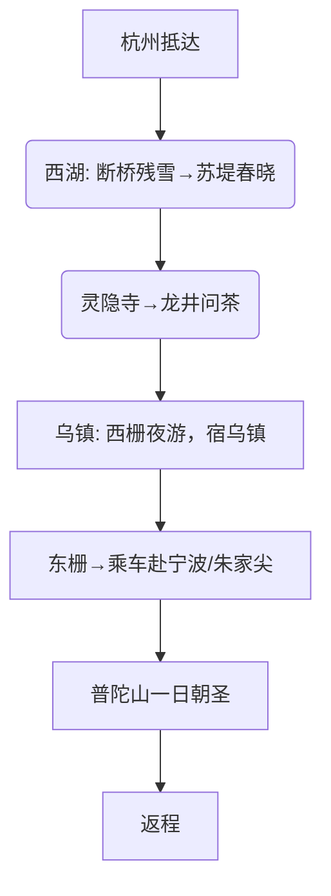
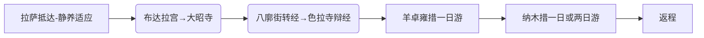

***

### 🏞️ 十一、浙江旅行指南（5日江南诗画）
**最佳时间**：3-5月（春暖花开）、9-11月（秋高气爽）
**核心体验**：
*   **杭州**：西湖（“淡妆浓抹总相宜”）、灵隐寺（千年古刹）、龙井村（品新茶）
*   **乌镇**：西栅夜景（灯火阑珊）、东栅晨曦（原住民生活）
*   **普陀山**：海天佛国，观音道场，心诚则灵

**行程规划**：

**交通**：
*   杭州、宁波均有机场和高铁站。杭州-乌镇有直达大巴（1.5h）。宁波/朱家尖码头乘船至普陀山（快艇15min）。
**住宿**：
*   杭州西湖边酒店（500-1500元/晚）、乌镇西栅内统一管理酒店（600-2000元/晚，体验好）
**美食**：西湖醋鱼、东坡肉、乌镇定胜糕、沈家门海鲜（舟山）
**费用参考**：人均2000-3500元
**避坑提示**：
*   节假日西湖周边极度拥堵，建议绿色出行（自行车/公交）。
*   乌镇西栅门票（150元）含免费摆渡船，进入景区后可乘坐。

---
### 🏛️ 十二、江苏旅行指南（5日古都园林）
**最佳时间**：4-5月（气候温和）、10-11月（秋色宜人）
**行程亮点**：
*   **南京**：中山陵、总统府（民国历史）、夫子庙秦淮河（夜景）
*   **苏州**：拙政园（中国园林之母）、苏州博物馆（贝聿铭设计）、平江路（评弹昆曲）
*   **扬州**：瘦西湖、大明寺、个园

**行程推荐**：
1.  **Day1**：南京抵达 → 总统府 → 夫子庙夜游
2.  **Day2**：中山陵 → 明孝陵 → 前往苏州
3.  **Day3**：苏州 → 拙政园 → 苏州博物馆 → 晚上逛平江路
4.  **Day4**：留园 → 虎丘 → 前往扬州
5.  **Day5**：瘦西湖 → 何园/个园 → 返程

**交通**：
*   省内高铁网络极其发达，南京-苏州-扬州之间1-2小时内通达。
**住宿**：
*   南京新街口/夫子庙附近、苏州观前街/平江路区域（300-700元/晚）
**美食**：南京盐水鸭、扬州早茶（烫干丝、蟹黄包）、苏州松鼠鳜鱼
**贴士**：
*   苏州园林讲究“一步一景”，建议租用电子讲解器或请导游。
*   南京大屠杀遇难同胞纪念馆周一闭馆，参观时请保持肃穆。

---
### ⛰️ 十三、安徽旅行指南（4日徽州寻梦）
**最佳时间**：3-4月（油菜花开）、11月（秋色如画）
**核心景点**：
*   **黄山**：“五岳归来不看山，黄山归来不看岳”，奇松、怪石、云海、温泉
*   **宏村/西递**：徽派古村落代表，白墙黛瓦马头墙，电影《卧虎藏龙》取景地

**行程规划**：
1.  **Day1**：黄山北站（高铁）抵达 → 乘车至汤口镇（黄山脚下）
2.  **Day2**：黄山一日游（云谷寺缆车上→始信峰→光明顶→飞来石→排云亭→宿山顶）
3.  **Day3**：黄山观日出 → 乘坐西海大峡谷地轨 → 玉屏楼（迎客松）→ 缆车下山 → 前往宏村
4.  **Day4**：宏村（南湖、月沼）→ 西递 → 返程

**交通**：
*   黄山风景区交通换乘中心有发往各景区的班车。汤口镇包车去宏村约100-150元。
**住宿**：
*   黄山山顶酒店（800-2000元/晚，条件有限但为看日出必须）、宏村画中客栈（200-600元/晚）
**费用参考**：人均1500-2500元
**避坑提示**：
*   黄山天气多变，务必带雨衣（比雨伞实用）。登山杖非常必要，可在山下租用。
*   不要被黑车司机忽悠，坚持到正规的换乘中心乘坐景区大巴。

---
### 🏝️ 十四、海南旅行指南（5日热带天堂）
**最佳时间**：11月-次年3月（旱季，阳光明媚，水温适宜）
**行程推荐**：
1.  **Day1**：三亚凤凰机场抵达 → 入住亚龙湾/海棠湾
2.  **Day2**：亚龙湾热带天堂森林公园 → 亚龙湾沙滩
3.  **Day3**：蜈支洲岛一日游（水上项目，如潜水、摩托艇）
4.  **Day4**：南山文化旅游区（108米海上观音）→ 天涯海角
5.  **Day5**：三亚国际免税城（购物）→ 返程

**交通**：
*   三亚市内可租车自驾（机场取还车方便）或打车。各湾区之间有旅游公交。
**住宿**：
*   **海棠湾**：奢华酒店云集，适合度假，离免税城近（800-3000元/晚）
*   **亚龙湾**：水质沙滩最佳，适合亲子（600-2000元/晚）
*   **大东海**：性价比高，离市区近，餐饮方便（200-700元/晚）
**美食**：文昌鸡、和乐蟹、东山羊、清补凉、海鲜大餐（去第一市场加工）
**贴士**：
*   潜水等水上项目选择正规机构，不要贪图小便宜。
*   免税品购物有额度限制（每人每年10万元），离岛时在机场/火车站/码头提货。

---
### 🙏 十五、西藏旅行指南（7日圣地朝圣）
**最佳时间**：5-6月、9-10月（避开雨季和严寒，含氧量较高）
**重要提示**：外籍及台湾游客需办理“入藏函”，港澳游客持回乡证即可。建议初次进藏者选择跟团游，更安全省心。

**行程规划（初次进藏经典线）**：

**交通**：
*   飞机或火车进藏。拉萨市区不大，打车方便。去纳木措等地需包车或跟团。
**住宿**：
*   拉萨市区供氧酒店（400-1000元/晚），可有效缓解高反。
**费用参考**：人均4000-7000元（不含大交通）
**高反与避坑**：
*   **高反**：抵达前几天不要洗头洗澡，避免剧烈运动，多喝水，心态放平。备好葡萄糖、高原安。
*   **尊重**：进入寺庙脱帽、脱墨镜，不踩门槛，顺时针参观。不要随意拍摄僧侣和磕长头的人。
*   **边防证**：若要去珠峰、阿里等地区，需提前办理边防证。可在户籍所在地或拉萨办理。

---
